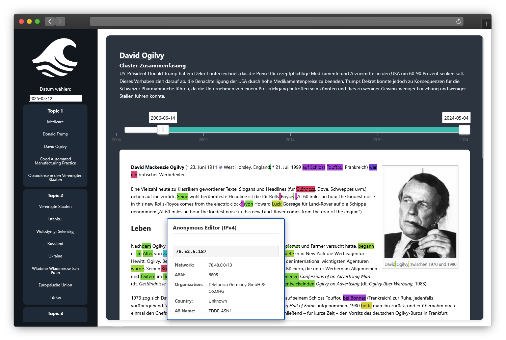

## **WAVE** - Wikipedia Analysis and Verification Engine

Simeon Flühmann (fluehsi2)  \
Elias Hager (hagereli) \
Joanna Gutbrod (gutbrjoa)

WAVE aims to link current events with relevant Wikipedia articles, providing a platform to visualize how changes to these articles relate to ongoing events.



More information about this project is available in the [blog post](https://bdp25.github.io/).

During WAVE’s development, we explored various approaches for identifying the most relevant Wikipedia articles for a given topic. The code and evaluation of these approaches can be found in the **research** branch of this repository.


---

### **Prerequisites**

Before deploying the project, ensure the following tools are installed on your system:

- [Docker](https://www.docker.com/)
- [Docker Compose](https://docs.docker.com/compose/)
- Git

---

### **Environment Setup**

1. Clone this repository:

   ```sh
   git clone <repository-url>
   ```

2. Move into the git repository directory:

   ```sh
   cd WAVE
   ```

3. Also clone the git submodules: \
This will ensure that all necessary submodules are included in your local copy of the repository.

   ```sh
   git submodule update --init --recursive
   ```
2. Move into the source directory:

   ```sh
   cd src
   ```

3. Copy the `.env.example` file to `.env` and fill in the required values:

   ```sh
   cp .env.example .env
   ```

   Update the `.env` file with your specific configuration, such as database credentials, API keys, and ports.

---

### **Deployment**

1. Build the required Docker images:

   ```sh
   docker compose --profile build build
   ```

2. Run the Docker Compose stack:

   ```sh
   docker compose --profile deploy up -d
   ```

   Use the `-d` flag to run in detached mode.

---

### **Accessing the Services**

- **Frontend**: Accessible at `http://localhost:<FRONTEND_PORT>` (default: 5000)
- **Orchestrator Dashboard**: Accessible at `http://localhost:<DASHBOARD_PORT>/admin` (default: 5050, default password: `changeme`)  
  - Set up recurring Tasks in the Orchestrator Dashboard.  
  - For testing run the following from the commandline: `docker run --rm --env-file .env --name data-collector-test --network wave_default data-collector --date "latest"`
- For real deployment, set up NginxPM in the dashboard exposed at `http://localhost:81`.

---

### **Troubleshooting**

1. **Docker Container Issues**:
   - Check the logs of a specific container:
     ```sh
     docker logs <container_name>
     ```

2. **Environment Variable Issues**:
   - Ensure the `.env` file is correctly configured and matches the required format.

3. **Port Conflicts**:
   - Verify that the ports specified in the `.env` file are not already in use.

4. **Rebuilding Images**:
   - If changes are made to the code or configuration, rebuild the images:
     ```sh
     docker compose --profile build build
     ```

---

### **Development**

For local development, you can modify the services and rebuild the images as needed. Use the following command to stop and remove all containers:

```sh
docker compose --profile deploy down
```

To clean up unused Docker resources:

```sh
docker system prune -f
```

---

### **Project Structure**

Below is the directory structure of the project, with explanations for the most important files:

```
WAVE
│
├── README.md                         # Project documentation (this file)
├── docker-compose.yml                # Docker Compose configuration for all services
├── .env.example                      # Example environment variables file
│
├── src                               # Main source folder for all services
│   ├── data-collector                # Service for collecting and processing data
│   │   ├── run.py                    # Main script for data collection
│   │   ├── clean_data.py             # Cleans and preprocesses collected data
│   │   ├── clustering.py             # Clustering logic for data analysis
│   │   ├── Dockerfile                # Dockerfile for the data-collector service
│   │   └── ...                       # Other scripts for data collection
│   │
│   ├── frontend                      # Service for the user interface
│   │   ├── app.py                    # Main Flask application for the frontend
│   │   ├── visualisation.py          # Visualization logic for displaying data
│   │   ├── Dockerfile                # Dockerfile for the frontend service
│   │   ├── static                    # Static assets (CSS, JS, images)
│   │   ├── templates                 # HTML templates for the frontend
│   │   └── ...                       # Other frontend-related files
│   │
│   ├── history-collector             # Service for collecting Wikipedia history data
│   │   ├── run.py                    # Main script for collecting historical data
│   │   ├── safe_wiki_to_db.py        # Saves Wikipedia data to the database
│   │   ├── Dockerfile                # Dockerfile for the history-collector service
│   │   └── ...                       # Other scripts for history collection
│   │
│   └── orchestrator                  # Service for orchestrating tasks
│       ├── app.py                    # Main Flask application for orchestrating tasks
│       ├── queue_api.py              # API for managing task queues
│       ├── utils.py                  # Utility functions for the orchestrator
│       ├── Dockerfile                # Dockerfile for the orchestrator service
│       └── ...                       # Other orchestrator-related files
│
├── Presentations                     # Folder for project presentations
│   ├── Architecture Diagramm.drawio  # Architecture diagram of the system
│   ├── Datenbank_schema.png          # Database schema visualization
│   └── ...                           # Other presentation files
│
└── ...                               # Additional files or folders

```
